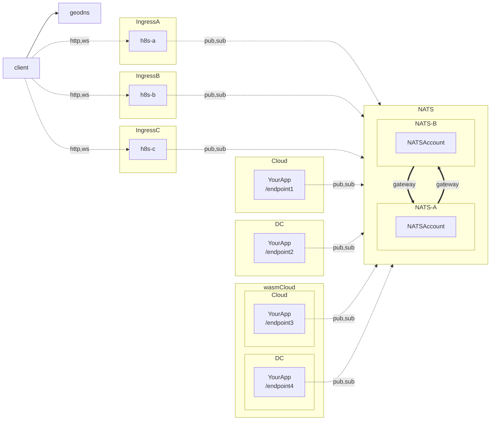
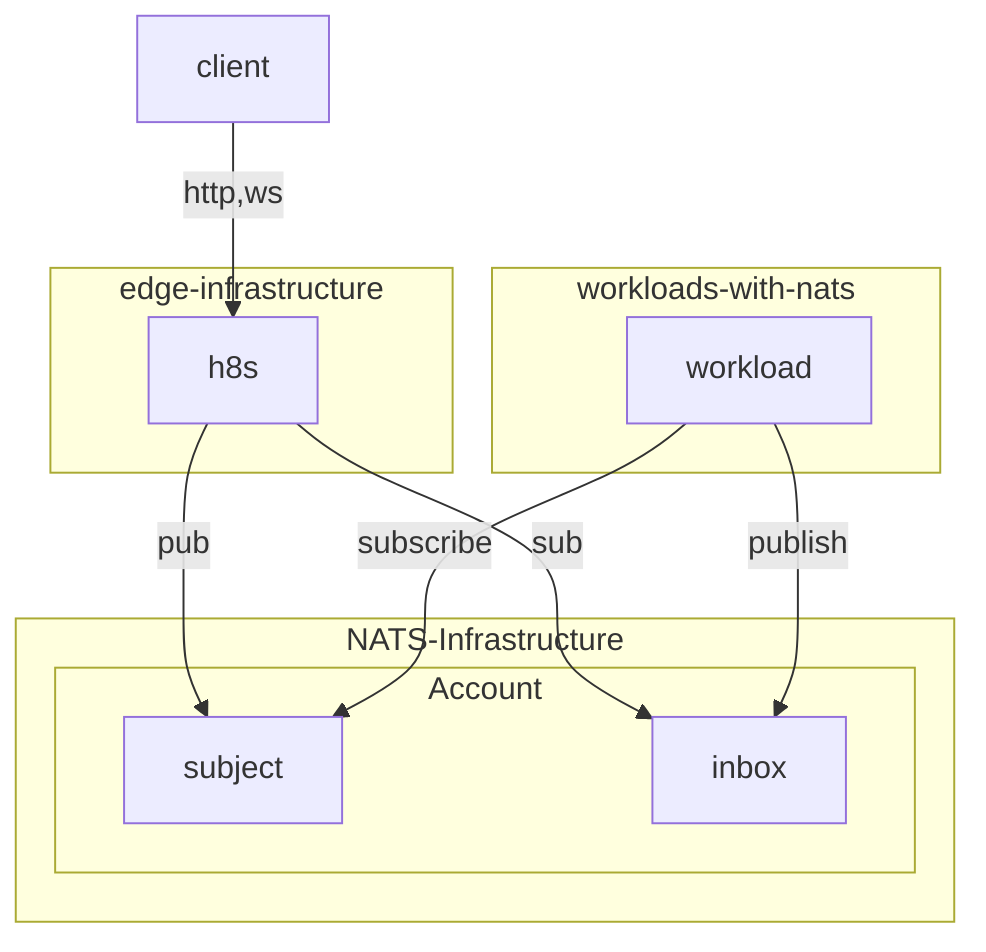
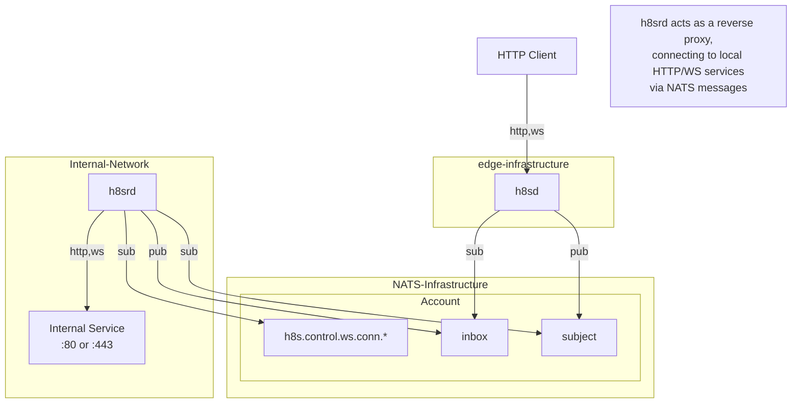

# h8s - HTTPToNATS - Event-Gapped Ingress

This is a infrastructure solution you may use to get http and websocket traffic into NATS.

It is designed for workloads that connect directly to NATS and act as responders on "by-convention" subjects.

The motivation for creating this is to never directly expose our wasmcloud environments or other workloads
directly. They should not have any incoming infrastructure requirements.

> *Just egress!*

<!-- end_slide -->

## Diagram - Vision 




## Diagram 1 - Workloads connected to NATS


<!-- end_slide -->

## Diagram 2 - Workloads connected via h8srd (Reverse Daemon)


<!-- end_slide -->


## Running the Daemons

### h8sd (Ingress Proxy)

`h8sd` is the ingress point that accepts HTTP/WS connections and forwards them to NATS.

```bash
# Basic usage
./h8sd --nats-url="nats://localhost:4222"

# With credentials and OpenTelemetry
./h8sd \
  --nats-url="nats://demo.nats.io:4222" \
  --nats-creds="./user.creds" \
  --otel-enabled=true \
  --otel-endpoint="localhost:4317"

# With security option (Max Body Size, Host Filters, Request Timeout, Allowed Origins)
./h8sd \
  --nats-url="nats://localhost:4222" \
  --max-body-size=10485760 \
  --host-filters="example.com,api.example.com" \
  --allowed-origins="https://app.example.com,https://admin.example.com" \
  --request-timeout=5s
```

`--allowed-origins` is optional; if omitted, WebSocket origins are not restricted.

### h8srd (Reverse Daemon)

`h8srd` runs alongside your backend service, subscribes to NATS subjects, and forwards requests to your local service.

```bash
# Basic usage
./h8srd --nats-url="nats://localhost:4222"

# With credentials
./h8srd \
  --nats-url="nats://demo.nats.io:4222" \
  --nats-creds="./user.creds"
  --nats-creds="./user.creds"
```

## Performance & Benchmarking

h8s includes a built-in benchmark suite to verify throughput and latency characteristics. The benchmarks test the core `h8sproxy` handler and NATS dispatcher loop.

To run the benchmarks:

```bash
go test -bench=. -benchmem -v ./pkg/h8sproxy
```

### Recent Results (Ryzen 7 7700X)

- **Sequential Request Processing**: ~68 µs/op (~14,000 req/sec per core)
- **Parallel Request Processing**: ~17 µs/op (~58,000 req/sec)

These benchmarks confirm that `h8sd` adds minimal overhead, with the primary bottleneck pushed to the downstream backend service.

