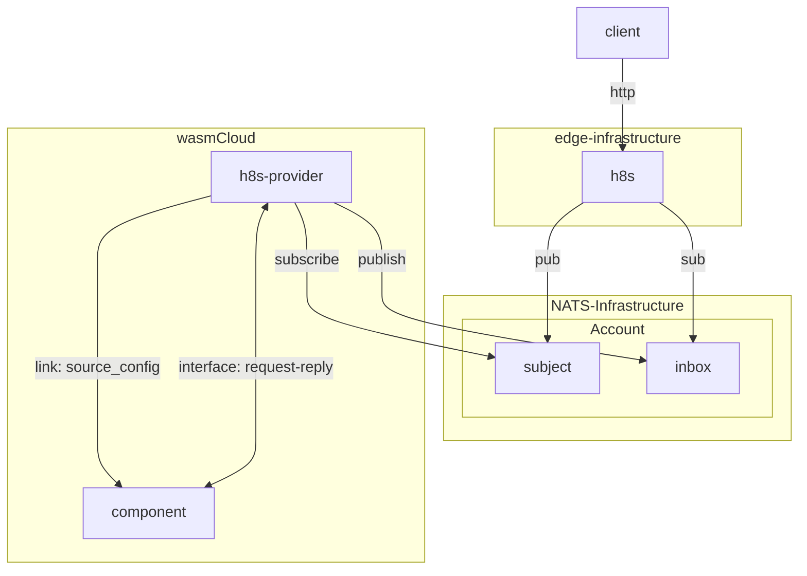
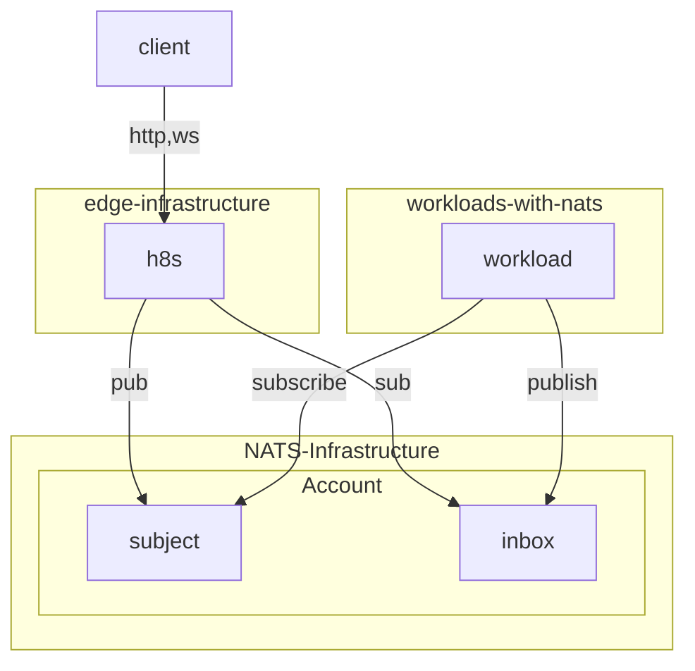
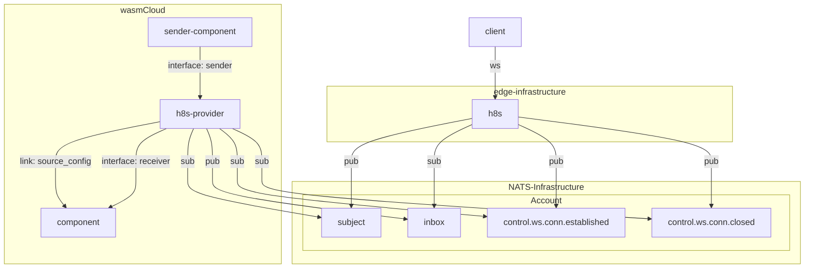

# h8s - HTTPToNATS - Event-Gapped Ingress

This is a infrastructure solution you may use to get http and websocket traffic into NATS.

It's designed to work with a wasmCloud h8s-provider that integrates with NATS
and implements a incoming-handler towards components. It also works for workloads that connect
directly to NATS and act as responders on "by-convention" subjects.

The motivation for creating this is to never directly expose our wasmcloud environments or other workloads
directly. They should not have any incoming infrastructure requirements.

> *Just egress!*

<!-- end_slide -->

## Diagram 1 - wasmCloud

<!-- end_slide -->
## Diagram 2 - Workloads connected to NATS

<!-- end_slide -->

## Subject Mapping of REST and Websockets

> The sender WIT interface provides a couple of functions: `'get-connections()' and 'get-connections-by-subject(subject)'.`
