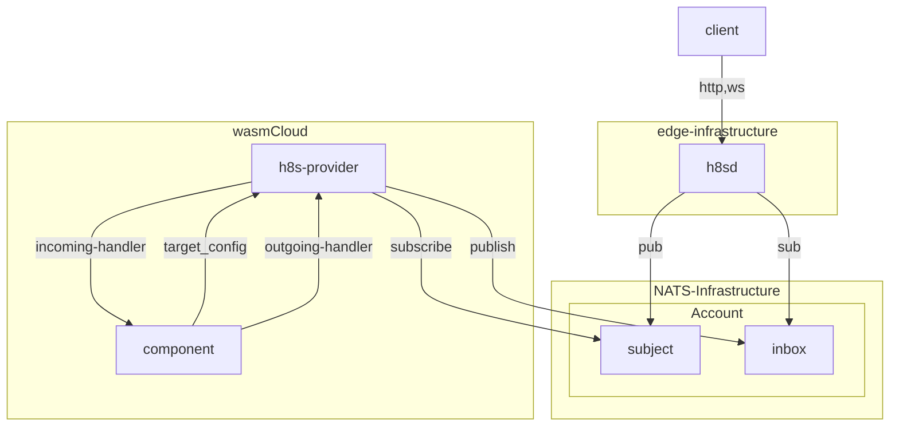

# h8s - HTTPToNATS

This is a infrastructure solution you may use to get http traffic into NATS.
It's designed to work with a wasmCloud h8s-provider that integrates with NATS
and implements the incoming-handler towards components.

The motivation for creating this is to never directly expose our wasmcloud environments
directly. They should not have any incoming requirements.

> *Just egress!*

<!-- end_slide -->

## Diagram

<!-- end_slide -->

## Subject Mapping of REST and Websockets

..wip..
