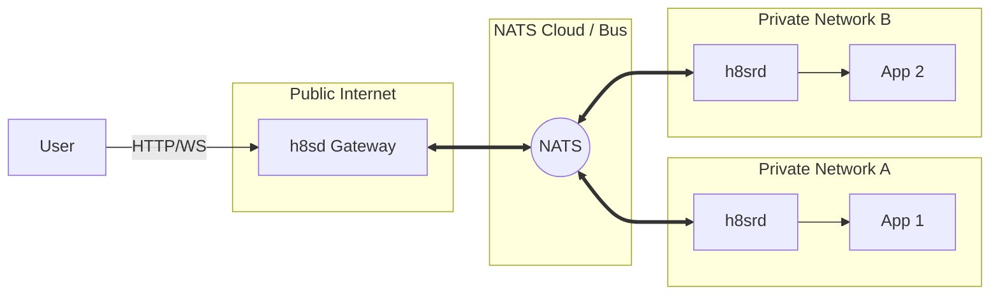
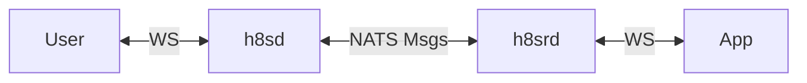

# h8s: HTTP-to-NATS Bridge

## "Event-Gapped Ingress"


### The Problem

- **Exposing internal services is hard and involves a lot of infrastructure you may not care about.**:
    - Firewalls
    - VPNs
    - Load Balancers
    - Certificates
    - Crafty SSH tunnels
    - Complex ingress controllers (Kubernetes)

> "I just want my local app accessible via a public URL."

<!-- end_slide -->

# The Solution

**Decouple** the **Ingress** (Public) from the **Service** (Private).

> Without opening any ports, egress to NATS is all you need.


### How?

Use **NATS** as the nervous system.

1. **h8sd (Gateway)**: Lives on the public internet.
2. **NATS**: Secure, high-performance messaging bus.
3. **h8srd (Reverse Daemon)**: Lives next to your app (private network).

<!-- end_slide -->

# Vision Diagram



<!-- end_slide -->

# Component: h8sd (Ingress)

**The Gateway**

- Listens on `:80` / `:443`.
- Accepts HTTP/WebSocket requests.
- Converts requests into **NATS Messages**.
- Publishes to a topic (e.g., `requests.host.foo.com`).
- Waits for a reply from the bus.

```bash
# Example Run
./h8sd --nats-url="nats://demo.nats.io:4222"
```

<!-- end_slide -->

# Component: NATS

**The Transport**

request: `GET /foo` -> Subject: `virt.foo.com`


- **Security**: TLS, Authenticaton (NKEYs/JWTs).
- **Topology**: Mesh, Leaf Nodes (connects anything to anything).
- **Performance**: Millisecond latency.

<!-- end_slide -->

# Component: h8srd (Reverse Daemon)

**The Agent**

- Connects OUTBOUND to NATS (no firewall holes needed!).
- Subscribes to subjects (e.g., `virt.foo.com`).
- Forwards traffic to `localhost:8080` (or any target).
- Sends the response back to NATS.

```bash
# Example Run (Private Network)
./h8srd --nats-url="nats://demo.nats.io:4222"
```

<!-- end_slide -->

# Flow: A Request's Journey

1. **User** makes request to `https://myapp.example.com`.
2. **h8sd** receives request.
   - Maps `Host: myapp.example.com` to subject `virt.myapp.example.com`.
   - Packs Headers + Body into a NATS Msg.
   - Publishes & Waits.
3. **NATS** routes message to subscriber.
4. **h8srd** (subscribed to `virt.myapp.example.com`) receives Msg.
5. **h8srd** requests `http://localhost:8080`.
6. **App** responds.
7. **h8srd** replies to NATS inbox.
8. **h8sd** receives reply and sends HTTP response to User.

<!-- end_slide -->

# Advanced: WebSockets

**Full Duplex Support**

h8s isn't just for REST. It tunnels WebSockets too!



- Control messages for Open/Close.
- Frames wrapped in NATS messages.

<!-- end_slide -->

# Security Benefits

- **Zero Open Ports**: Your backend requires NO incoming ports.
- **Isolation**: Public node (`h8sd`) is physically separated from Backend (`h8srd`).
- **NATS Auth**: Granular permissions (who can subscribe to what).

<!-- end_slide -->

# Demo

Let's see it in action!

1. Start NATS.
2. Start `h8sd` (Gateway).
3. Start `h8srd` (Agent) -> pointing to `httpbin`.
4. Curl the gateway!

<!-- end_slide -->

# Q&A

**h8s**
*Event-Gapped Ingress*

Check out the code:
[github.com/h8s-dev/h8s](https://github.com/h8s-dev/h8s)
